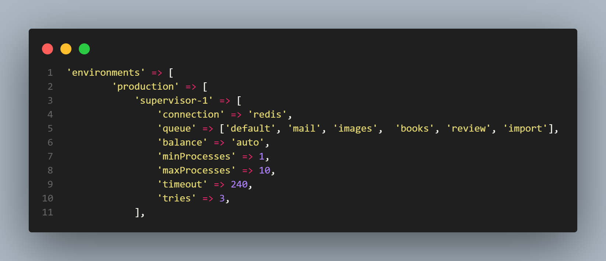
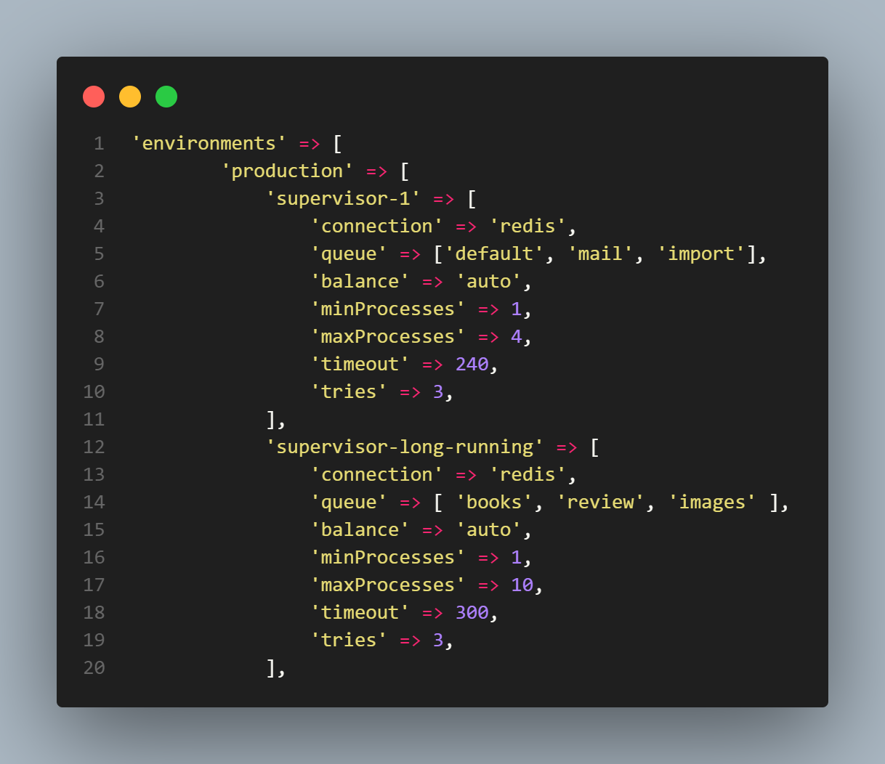

# Uma abordagem para o Laravel Horizon

Se sua aplicação Laravel faz uso de filas e do [redis](https://redis.io/docs/about/), acrescentar o [Laravel Horizon](https://laravel.com/docs/master/horizon) pode ser uma opção interessante para trazer mais performasse e melhorar o gerenciamento dos jobs processados em sua aplicação.

**OBS:** Nesta abordagem fizemos uso do Laravel 6.0 e Horizon 3.7.2


## Dividir para conquistar
Ninguém melhor que você para saber quais filas possuem um  maior fluxo de entrada e quais possuem maior processamento, mas caso não tenha essa informação isso é só mais um motivo para usar o horizon, uma vez que ele gera métricas que são apresentadas em um dashboard simples e intuitivo.

Para tirar o máximo de proveito do balanceamento do horizon é necessário agrupar suas filas da melhor forma possível, caso ainda não tenha entendido bem como esse balanceamento funciona sugiro que leia esse artigo do [Zechariah Campbell](https://medium.com/@zechdc/laravel-horizon-number-of-workers-and-job-execution-order-21b9dbec72d7) que explica de maneira bem detalhada.

Acredito que o auto balanceamento seja o modelo ideal para sistemas em que as filas tem picos de processamento em certos momentos do dia, assim mais processos são destinados para a fila com mais jobs em espera afim de zera ou deixa o número de jobs em espera próximo aos das demais filas.

Por padrão nosso arquivo ***config/horizon.php*** o array de environments tem um formato semelhante ao da imagem a seguir



Se por exemplo as filas ***books*** e ***images*** consomem muito tempo de processamento e possuem 500 jobs em espera e as demais filas estão zeradas, ambas terão mais processos para despacharem seus jobs. Em um dado momento a fila ***import***, que consome pouco tempo de processamento, tem um pico e fica com 3000 jobs em espera, neste momento parte dos processos sao descolocados para ***import*** afim de reduzi-la o quanto antes.

O problema na situação é que o balanceamento tornará a execução das filas ***books*** e ***images*** mais lento ainda por ter que deslocar processos para a fila ***import***. Para resolver isso devemos dividir nosso supervisor-1 em dois, um responsável por executar os jobs das filas com tempo de processamento e quantidade elementos em espera menor e outro com as filas de maior tempo de processamento e quantidades de jobs em espera, como mostrado na imagem a seguir.



Nesse novo modelo as filas ***default***, ***mail*** e ***import*** terão pelo menos um processo cada e a soma de todos os processos em todas as filas é de no máximo quatro, aqui também definimos o timeout para estas filas que é de 240 segundos com tolerância de 3 tentativas antes de falha. Essa estrutura garante que o balanceamento irá distribuir os processos disponíveis, de acordo com a necessidade, somente as filas descritas.

As demais filas terão mais processos disponíveis com maior timeout, evitando que o balanceamento tire processos de quem já não tem tanto processamento e as filas tenham muitos jobs em estado espera comprometendo o funcionamento da aplicação.

### **Definindo o a conexão com o Redis**

O arquivo ***queue.php*** é responsável por definir como o dever ser a conexão do banco de dados com as filas no Laravel, neste arquivo definimos como o Redis deve se conectar as filas monitoradas no Horizon, o arquivo terá o seguinte formato. Observe que no paramentro ***retry_after*** defini quanto tempo a conexão ficará aberta.

```PHP
'connections' => [
    //outras conexões
    'redis' => [
            'driver' => 'redis',
            'connection' => 'default',
            'queue'  => 'default',
            'retry_after' => 600,
        ],
],
```

## O poder das tags

De todas a vantagens apresentadas pelo uso do Laravel Horizon, para mim a melhor de todas é o uso de tags de monitoramento. Com elas podemos supervisionar a fila, o job e o model que foram executados permitindo saber qual teve sucesso ou falha, numero de execuções e a qual fila pertence aquele job.

Por padrão o Horizon atribui uma tag para cada job que recebe um model, por exemplo se temos a fila import que é responsável por adicionar novos livros ao sistema, para cada livro inserido na fila o cria a seguinte tag **'App/Book:id'** onde **id** indica o índice do livro em sua tabela no banco de dados. 

Essa comportamento tem seu valor, mas somente em sistemas  onde toda fila recebe um model especifico, para casos mais complexos eu prefiro criar tags manualmente, pois assim é possível ter uma visão ampla do funcionamento das filas/jobs e encontrar falhas em um curto prazo.

### **Uma abordagem para tags**

Para criar tags manualmente em cada job você deve criar uma função publica de nome ***tags*** que deve retornar um array de strings, isso mesmo um job pode possuir uma ou mais tags, tornando sua busca mais ampla.

Imagine que em um sistema de biblioteca exista um job de nome ***SendReturnAlert*** responsável por enviar um email de alerta pra que os usuários que tenham que devolver livros nos próximos 3 dias sua função construtora teria o seguinte formato.


```PHP
public function __construct(int $userId, int $bookId) {

    $this->userId = $userId;
    $this->bookId = $bookId;
}
```

O padrão que uso no array de tags é colocar o nome do job como primeiro elemento seguido dos ids dos models associados e colocar nome da fila que job é processado por ultimo, para este exemplo teremos o seguinte resultado.

```PHP
public function tags() {
    return ['SendReturnAlert','User:'. $this->userId,'Book:'. $this->bookId, 'default'];
}
```

A partir de agora dentro do Horizon podemos pesquisar jobs processados com exito ou não que tenham sua origem no job ***SendReturnAlert***, no usuário, no livro ou na fila. Assim em caso de falha podemos identificar se problema tem origem na escrita do job, em algum dado do usuário, em alguma informação do livro ou na fila.    
### **Usando commands**

Em muitas situações precisamos reprocessar jobs falhados, na própria interface do laravel horizon é possível fazer a ação manualmente, o que não é muito viável, mas pode resolver casos muito pontuais. Uma abordagem um pouco mais pratica e de fácil implementação é criar um [**Command**](https://laravel.com/docs/6.x/artisan#writing-commands) que acesse todos os jobs falhados e faça o reprocessamento.

Algo que não foi mencionado aqui e precisa ser explicado é quanto a persistência dos dados armazenado no horizon,  no arquivo ***config/horizon.php*** quanto tempos ficará arquivado os jobs recentes, completados, falhados recentemente, falhados e monitorados. Temos a seguinte configuração padrão do sistema.

```PHP
'trim' => [
    'recent' => 60,
    'completed' => 60,
    'recent_failed' => 10080,
    'failed' => 10080,
    'monitored' => 10080,
],
```

O número aqui representa a duração em **minutos** e pode ser customizado de acordo com a necessidade de sua aplicação, mas é importante que você saiba que quanto maior for esse valor, maior será o tamanho ocupado pelo disco do redis. Em casos estouro o horizon para de funcionar imediatamente comprometendo todo o funcionamento das filas e consequentemente da aplicação.

Com o command criado mudamos sua assinatura para receber como parâmetro opcional o nome do job que queremos reprocessar, assim quando executamos o command sem ele **todos** os jobs falhados serão reprocessados. Essa versão foi criada a partir do post do [Kodeas](https://kodeas.medium.com/programatically-retrying-failed-jobs-in-horizon-8acad3695b38)

```PHP
 protected $signature = 'horizon:retry-failed-jobs {jobName?}';
```
Em nossa função construtora recebemos **JobRepository** como parâmetro, que nada mais é que a interface criada pelo Laravel Horizon para acessar todas as informações dos jobs processados por Horizon, este é o resultado.

```PHP
public function __construct(JobRepository $jobs) {
    parent::__construct();
    $this->jobs = $jobs;
}
```

Fazendo uso da interface obtemos o array de todos os jobs falhados e a partir daí podemos ter informações especificas de cada job como seu id, nome, fila que foi processado, data que foi falhado. Fica a seu critério escolher filtrar os jobs, aqui fiz preferencia por nome caso seja passado como parâmetro.

Também fazemos uso da classe **RetryFailedJob** para reprocessar o job falhado a partir de seu id e da função **deleteFailed** para remover o job falhado como demonstrado no código a seguir.


```PHP
public function handle() {
    $jobName = $this->argument('jobName');
    
    $failedJobs = $this->jobs->getFailed();

    
    if($jobName != NULL) {
        foreach ($failedJobs as $failedJob) {

            if (preg_match("/$jobName/i", $failedJob->name) ) {
                
                $id = $failedJob->id;
                dispatch(new RetryFailedJob($id));
                $this->jobs->deleteFailed($id);
            } 
        }
    } else {
        foreach ($failedJobs as $failedJob) {

            $id = $failedJob->id;
            dispatch(new RetryFailedJob($id));
            $this->jobs->deleteFailed($id);        
        }
        
    }
}

```